# **CS 193 Lab 3 - Vim, IntelliJ, & Debugging**

In this lab you will learn some of the fundamentals of debugging your code, as well as some of the tools you have at hand in 2 applications you'll be using a LOT in your CS studies and beyond:

*   Vim (Text Editor)
*   IntelliJ IDE (Integrated Development Environment)

## 
**Part 1: Vim**

### 
**1.1: Text Editors**

Text Editors (such as Vim, Pluma, nano, and Emacs) are very general in their abilities:

*   You can read nearly any file BUT this means you are forced to be generic
*   Minimalistic Design = Minimal CPU/memory Impact

**For this lab, we'll introduce the versatile Vim text editor.**

### 
**1.1.1: Learn your Editor's commands!**

Vim's commands are strange, but we promise it will make your life easier… eventually. Seriously though, writing code gets a whole lot faster with vim!

#### 
**"The Vim Tutor!"**

Enter a terminal environment where you have Vim installed (most UNIX-based systems like Linux, Mac, and Windows computers have it pre-installed).

Once you're in the shell, type `vimtutor`.

The file will walk you through everything you need to know about Vim!

While useful, a more recent (and better-looking) learning tool is out there...

#### 
**OpenVim (this is pretty neat)**

This great open-source tool for Vim-learning is called [OpenVim.com](https://openvim.com/).

It's a lot more interactive than `vimtutor`, and offers a more comfortable (and prettier) environment to practice in.

Run through the tutorials on the website to get a solid grasp of vim, and bookmark it in case you forget!

#### 
**Vim Cheat Sheet**

Finally, if you ever need to quickly check what Vim commands are available (or if you'd like to expand your Vim vocabulary), check out these cheat sheets:

*   [vim.rtorr.com](https://vim.rtorr.com/)
*   [vimsheet.com](http://vimsheet.com/)

### 
**1.1.2: A solid .vimrc goes a long way**

#### 
**Wait… what's a .vimrc?**

From the tutorials above, you should have learned about how Vim enables commands by typing colon ":" followed by your command.

However, some commands you don't want to have to type _every time_.

Well, your .vimrc (Vim Run Control) file controls what commands run when vim is invoked, and you can customize it to your heart's content. These commands are run _every time you open a new file_.

#### 
**TODO: Add Line Numbers**

You should use Vim to add the following command to your .vimrc file located in your home directory (~/.vimrc).  To edit that file with vim, run: `vim ~/.vimrc`

Add the text `set number` to the file, and save it!

Next time you open any file, you should see line numbers!

You can disable this at any time within a file by typing `:set nonumber` within Vim, or by deleting it from your .vimrc and then re-opening Vim again.

#### 
**TODO: Add your own commands!**

For this task, add **_at least_ _3 more commands_** to your .vimrc file and turn it in.

For a great resource on .vimrc creating, read [this article](https://dougblack.io/words/a-good-vimrc.html).

_Colorscheme badwolf does not work without modifications… _

_If you're curious to find out why: [https://askubuntu.com/questions/758011/badwolf-color-scheme-does-not-work-on-ubuntu-14-04](https://askubuntu.com/questions/758011/badwolf-color-scheme-does-not-work-on-ubuntu-14-04)_

A favorite quote from that article that you should definitely adhere to is:

>"Don't put any lines in your vimrc that you don't understand."

### 
**1.2: Integrated Development Environments**

IDEs do have their advantages!!!

An Integrated Development Environment (IDE) describes applications that contain:

*   A fully featured source code editor
*   Version Control System integration (think Git/GitHub)
*   Build automation tools
*   **Some form of _Debugging Tools_!**
*   For those of you in CS180, we expect that you have some very basic familiarity with the IntelliJ platform.

## 
**Part 2: Debugging Methods**

### 
**2.1: Printing**

One of the most old-fashioned, yet effective, methods of debugging is print statements.

Print statements are simple, effective, and fast. It helps us keep track of variables and shows us the states of various methods at given times. 

Although powerful, print statements can be hard to keep track of when working with programs with thousands of lines of code or programs that segfaults. Let's explore the debugger!

### 
**2.2: Debugging**

While print statements are absolutely useful for isolating a problem, they can be quite difficult and scale poorly. Nothing is more difficult to sift through than huge log files or output text when all you needed to do was step through your code a bit to determine what was wrong.

_In an ideal world, we'd want to be able to walk through our code step-by-step, and figure out what's going on **DURING** execution..._

#### INTRODUCING: THE INTELLIJ DEBUGGER!

The IntelliJ Debugger allows you to:

*   Step through the execution of a program line-by-line
*   Set _breakpoints_ at important sections of code
    *   Execution will pause at the breakpoint
    *   You may either _step_ through execution or _continue_ to the next breakpoint
*   Track the value of variables throughout execution & check if they are modified

If you're having a hard time with using the debugger, visit [this link](https://www.jetbrains.com/help/idea/debugging-your-first-java-application.html)

## 
**Part 3: The Scenario**

Picture this: You land a great internship as a Freshman thanks to all the skills you learned in CS193, and are put to the task of picking up where last year's IU intern left off.

Needless to say, they've left a mess of things. It's up to you to identify what's wrong with their code!

### 
**3.1: Check out this repository from version control**

Without getting too deep into the commands of git, we want to "clone" our repository and edit it locally like any other file (if you are interested, [check out this guide)](http://rogerdudler.github.io/git-guide/)

IntelliJ has a great deal of support for exactly this! We can store a local version of our repository, and push any changes to the remote repo easily!

#### 
**How to clone remote repo to local repo and manage it with IntelliJ**

0.  Close any projects you have open

File --> Close Project

You should now see the main IntelliJ screen.

1.  Checkout a project from Version Control

You will want to be at the main IntelliJ screen and select Check out from Version Control --> GitHub (Git is also acceptable).

**NOTE: If you just clone without letting IntelliJ configure everything for you, it's a pain in the butt to fix. Please let IntelliJ create everything for you!**

**ANOTHER NOTE: If you did not close projects and end up on the main IntelliJ screen, you can also just go to VCS --> Checkout from Version Control**

2.  Enter your credentials for GitHub using Auth Type: Password

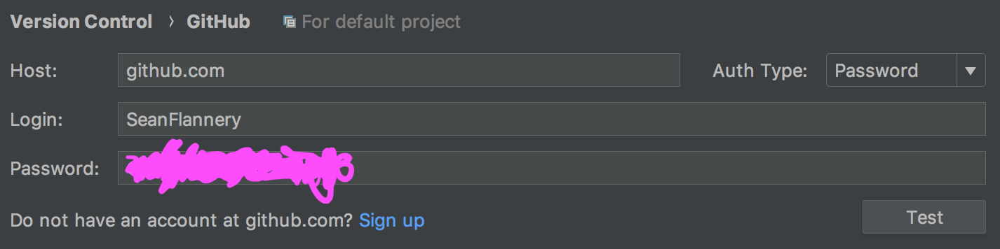

3.  Select the correct repository to clone

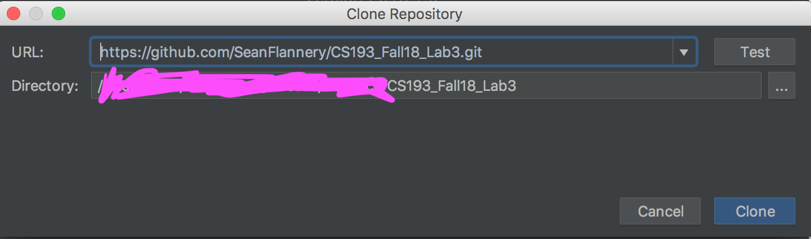

4.  Make some changes to the documents (don't worry about if it can run yet -- comments are fine too)

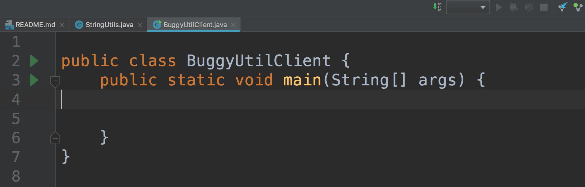
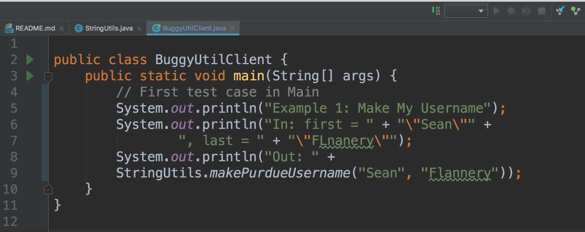

5.  Commit and push your changes

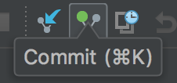
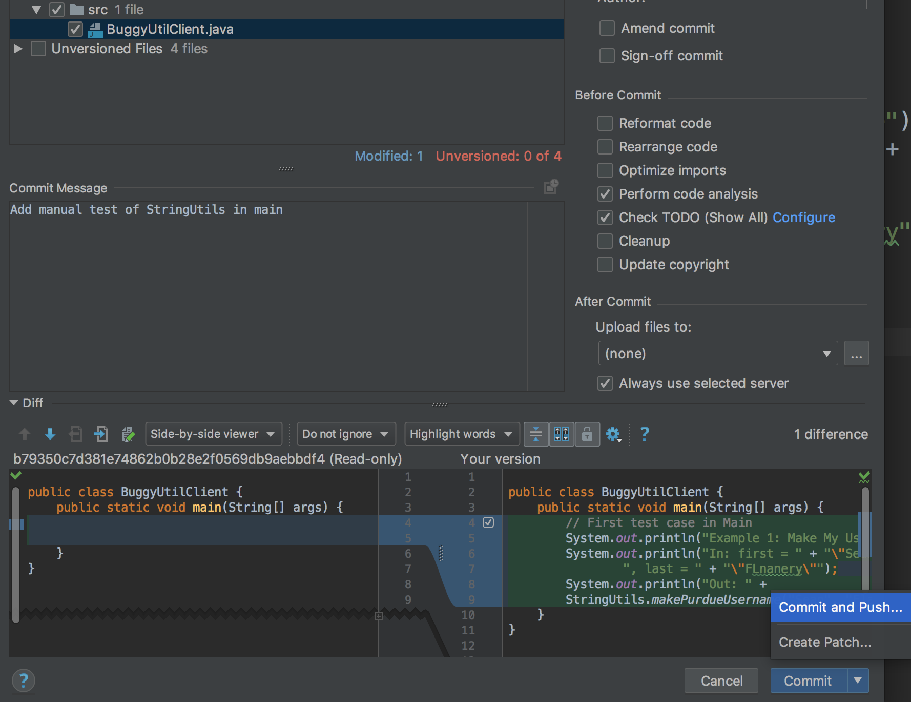

6.  Confirm you'd like to push changes

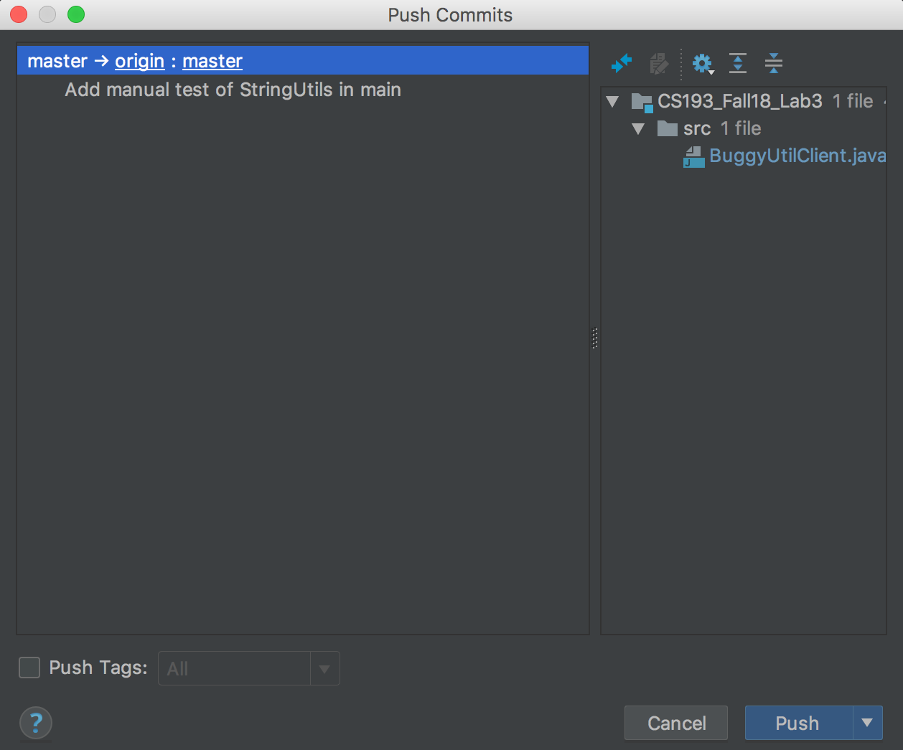

#### NOTE: Each time you open this project, make sure you PULL to make sure your local repository is up to date with the remote repository

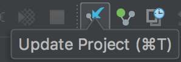

### 3.2: Sleuthing for Bugs

**TODO: You will be expected to find several bugs throughout the files MathUtils.java and StringUtils.java. All test cases should pass for your to receive full points.**

You should use multiple methods to determine what's wrong:

*   JUnit Test Cases -- Try running them individually and debugging them in isolation!
*   Print Statements after writing examples in _BuggyUtilClient.java_
*   Reading through the code to see if it makes sense

#### 
**How to run and debug the JUnit test cases**

1.  Configure IntelliJ for JUnit

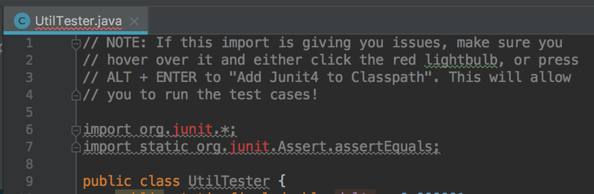

You just need to hit ALT + ENTER and choose "Add JUnit4 to classpath". ALT + ENTER is your friend in IntelliJ :)

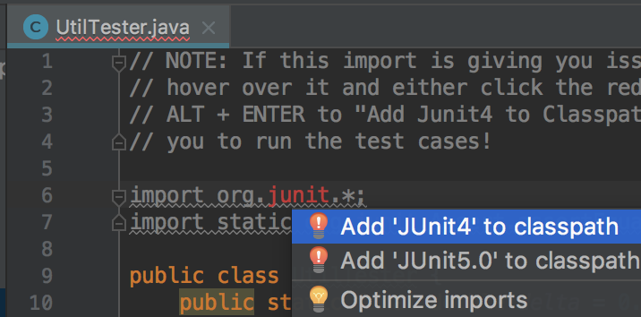

2.  Run all the test cases

You can run all test cases by right clicking the test case file.

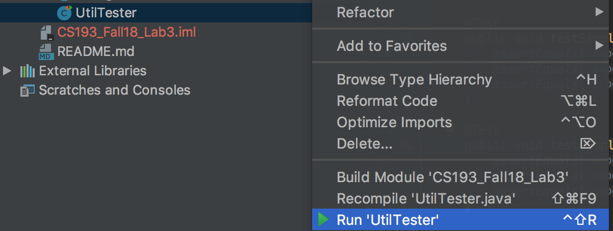

##### Note on test case results:
-  is good, because you passed all checks
-  means you got a wrong result in a test case
-  means an exception was encountered when running the case

3) Run a particular test case

You can also isolate a single test case and run only that one by right-clicking it.

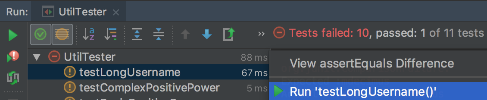

This results in:

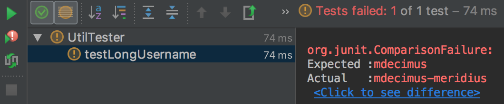

4) Find the line where it goes wrong

Once the test case fails, you can pinpoint the exact issue by double-clicking the failed
case. This will show you either the assert statement you got incorrect, or the line where
an exception was encountered.

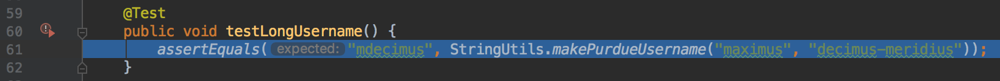

5) Set method and line breakpoints and start test case in Debug mode

Set some breakpoints in the methods you suspect this test case has 
touched, and then run the test case in Debug mode.

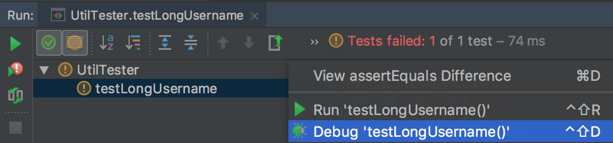

6) Continue stepping through the code and find the issue

You can see the step-by-step execution of your code, as well as the values of variables
and how they change.

To move onto the next breakpoint sector, you have to resume the program.

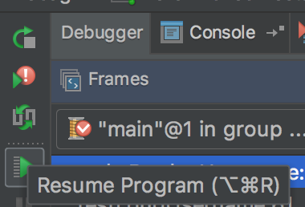

7) Take advantage of the information you find, and just keep stepping!

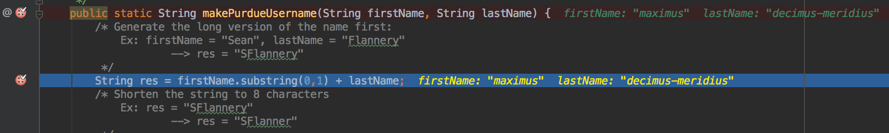

### 3.3: Submit Working Code - "Talk is cheap. Show me the code."
*TODO:* You should submit code that passes all test cases! 

*REMEMBER: Just because something OUGHT to work, does not mean it will. Always question any assumptions
or claims made about how code behaves!*

## TODO -- What needs to get done for this project
- Add 3 commands to your ~/.vimrc file
- Pull Git Repository into IntelliJ
- Use print statements and the IntelliJ Debugger to fix the code
- Submit working code to remote repository that passes all test cases
